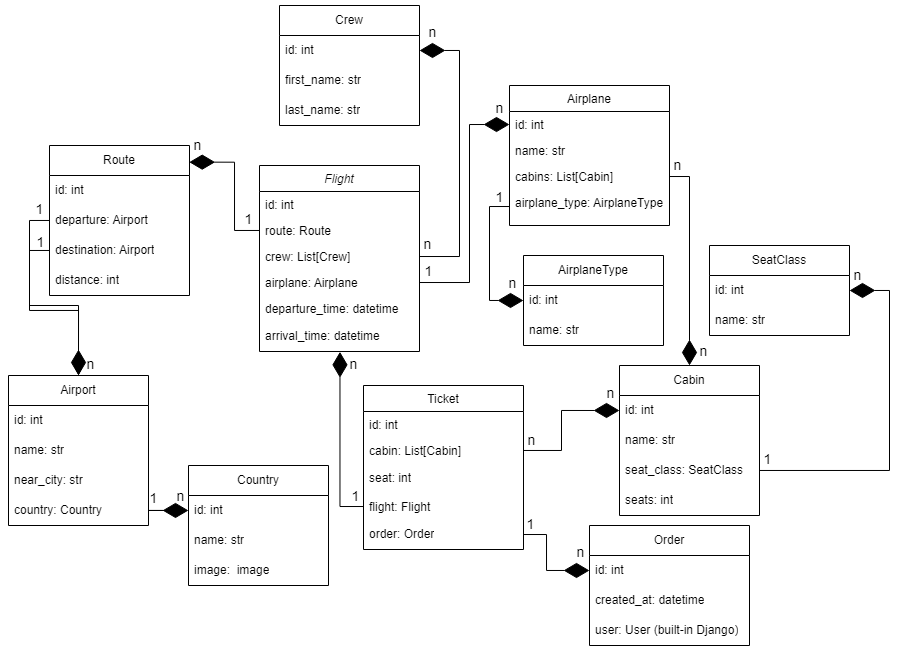

# Airport API

Service for creating orders with tickets for airplane flights and managing information about the flights, airports and airplanes.

## Installation

Python3 and Docker must be already installed.

```shell
git clone https://github.com/vlodek69/airport-api
cd airport-api
python -m venv venv
venv\Scripts\activate (on Windows)
source venv/bin/activate (on macOS)
```
Copy .env-sample -> .env and populate with all required data.
```
docker-compose up --build -d
```

## How to use

Once the server is up and running, create superuser:

- First execute an interactive Bash shell on the app's container
```shell
doker exec -it <container_name> bash
```

- Then create superuser in the shell
```shell
python manage.py createsuperuser
```

See the documentation on `/api/doc/swagger/` endpoint.

## Features

1. Users can create orders with tickets for desired airplane flight.
2. Staff users can manage info about the flights. Such as:
    - Airports, served as destination and departure points. Includes information about the name of the country and of the nearest city;
    - Airplanes with customisable cabins of different seat capacities and comfort classes;
    - Flights.
3. Flight endpoint, besides info about the route, airplane, and time of departure/arrival, includes an image of destination country.
4. Filtering of Flights by departure/arrival points and by date of departure.
5. Authentication implemented using JWT.
6. Documentation implemented using Swagger UI.

## Diagram


